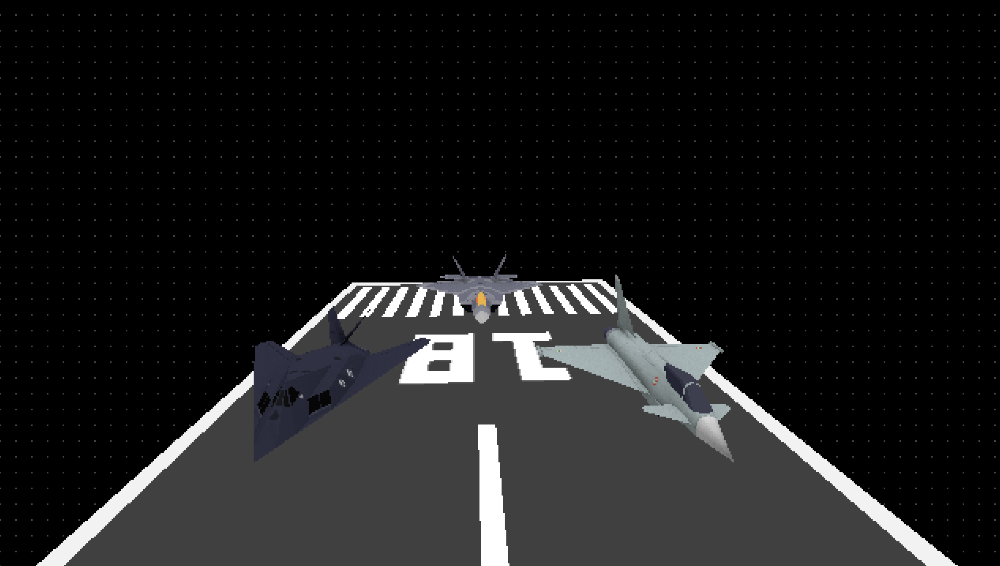

# 3DRenderer

A CPU software 3D renderer written in C (C99). It uses SDL2 for windowing and input, decodes PNG textures via upng, and renders textured OBJ meshes through a basic lighting pipeline.

## Screenshots

## Features
- Software rasterizer with z-buffer.
- OBJ mesh loading (vertices, UVs, normals) and PNG textures.
- Directional light with flat and Gouraud shading.
- Backface culling and view frustum clipping.
- Rendering modes: wireframe, flat shaded, Gouraud shaded, textured.
- Free-look camera controls with relative mouse mode.

## Rendering Pipeline
High-level stages per mesh:
1. Model to world (scale, rotation, translation).
2. World to view (camera look-at matrix).
3. Backface culling (optional).
4. Frustum clipping (six planes).
5. Projection and perspective divide.
6. Viewport transform to screen space.
7. Rasterization and z-buffer test.

The pipeline runs per triangle. Gouraud shading uses per-vertex normals from the OBJ; if no normals are provided, a constant intensity is used.

## File Formats
OBJ support (loader in `src/Mesh/mesh.c`):
- Vertex positions: `v x y z`
- Vertex normals: `vn x y z`
- Texture coords: `vt u v`
- Faces: `f v/vt/vn` or `f v//vn`
- Quads are split into two triangles

Textures are PNG files decoded by upng.

## Build (Windows)
Prereqs:
- GCC/MinGW with `make` available in your PATH.

Commands (from repo root):
- `make` - Build the renderer.
- `make run` - Build (if needed) and run.
- `make clean` - Remove build artifacts.
- `make rebuild` - Clean and rebuild.

The output binary is `bin/renderer.exe`. Ensure `bin/SDL2.dll` is present next to it. The Makefile expects SDL2 import libraries under `lib/` and headers under `vendor/SDL2/include`.

## Controls
- Mouse move: look around (cursor locked/hidden).
- W / S: move forward / backward.
- 1: wireframe vertices
- 2: wireframe
- 3: flat shaded
- 4: flat shaded + wireframe
- 5: Gouraud shaded
- 6: Gouraud shaded + wireframe
- 7: textured
- 8: textured + wireframe
- C: enable backface culling
- V: disable backface culling
- Esc: quit

## Assets
- Models: `assets/models/*.obj`
- Textures: `assets/textures/*.png`

The default scene loads a runway plus three aircraft meshes:
- `assets/models/runway.obj` with `assets/textures/runway.png`
- `assets/models/f22.obj` with `assets/textures/f22.png`
- `assets/models/efa.obj` with `assets/textures/efa.png`
- `assets/models/f117.obj` with `assets/textures/f117.png`

Each mesh uses the scale, translation, and rotation passed to `load_mesh(...)` in `setup()`. The scene is static by default; the update loop processes each mesh without applying an automatic per-frame model rotation. To swap models, textures, or placement, update the `load_mesh(...)` calls in `src/main.c`.

## Configuration Tips
- Projection settings (FOV/near/far) are set in `src/main.c` inside `setup()`.
- Default render mode and culling are set in `setup()`.
- Target FPS is defined in `include/Graphics/display.h` (`FPS`).
- Internal render resolution is `display / 3` (see `src/Graphics/display.c`); the color buffer is scaled to the window size.

## Project Layout
- `src/` and `include/`: renderer source and headers
- `src/Graphics`: SDL window, color buffer, z-buffer, and drawing primitives
- `src/Math`: vectors, matrices, and transforms
- `src/Mesh`: OBJ parsing and mesh data
- `src/Rendering`: clipping and textured drawing
- `src/Lighting`: directional light math
- `assets/`: OBJ models and PNG textures
- `vendor/`: third-party dependencies (SDL2 headers, upng)
- `lib/`: SDL2 import libraries
- `bin/`: output binary and runtime DLLs

## Troubleshooting
- Blank window: confirm the model/texture paths are correct and the texture PNG exists.
- Missing DLL error: verify `bin/SDL2.dll` is present next to `renderer.exe`.
- Black or clipped mesh: check FOV/near/far values and mesh translation in `setup()`.

## Notes
- The renderer uses SDL2 for input and presenting the color buffer. All rasterization happens on the CPU.
- OBJ files without vertex normals will render with constant intensity in Gouraud mode.
